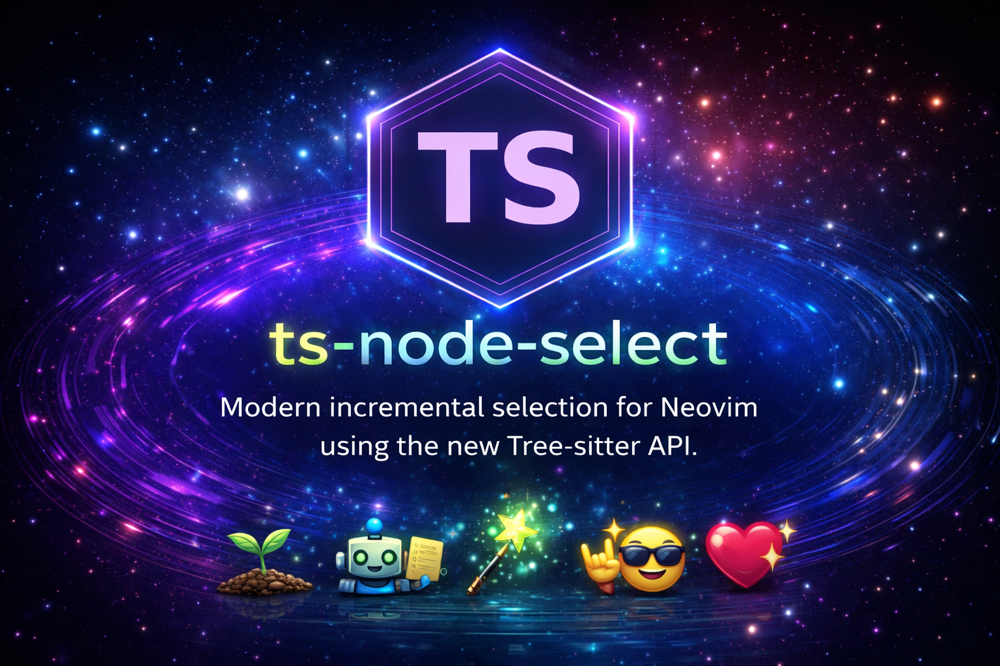

<p align="center">
  
</p>

<h1 align="center">ts-node-select</h1>

<p align="center">
  🌳 <b>Modern incremental selection for Neovim using the new Tree-sitter API</b> 🌳
</p>

<p align="center">
  <a href="https://github.com/shreyanshvyas414/ts-node-select/stargazers">⭐ Stars</a> ·
  <a href="https://github.com/shreyanshvyas414/ts-node-select/issues">🐛 Issues</a> ·
  <a href="https://github.com/shreyanshvyas414/ts-node-select/blob/master/LICENSE">📜 License</a>
</p>

<p align="center">
  🚀 Built with the new <code>vim.treesitter</code> API ·
  🧠 Deterministic selection ·
  ✨ Hackable & lightweight
</p>

<p align="center">
  🌱 → 🌿 → 🌳 <br/>
  <sub>Select smarter. Expand cleaner. Shrink predictably.</sub>
</p>

# ts-node-select

Modern incremental selection for Neovim using the new Tree-sitter API.

`ts-node-select` is a lightweight Neovim plugin that re-implements incremental
selection on top of the **new `vim.treesitter` API**, replacing removed and
deprecated behavior from `nvim-treesitter`.

---

## Why ts-node-select?

`nvim-treesitter` deprecated and removed the old `incremental_selection` module.
This plugin exists to:

- Restore incremental syntax selection
- Use the new official Tree-sitter API
- Include comments, punctuation, and unnamed nodes
- Avoid frozen or deprecated APIs
- Stay small, predictable, and hackable

If you previously used `init_selection`, `node_incremental`, and
`node_decremental`, this is the modern replacement.

---

## Features

- Incremental selection using real Tree-sitter nodes
- Selects the smallest syntax unit under the cursor
- Expands selection to parent nodes
- Shrinks selection step-by-step
- Skips parents with identical ranges (prevents stuck expansion)
- Buffer-local keymaps
- Activates only when a Tree-sitter parser is available

---

## Installation

### lazy.nvim

```lua
{
  "shreyanshvyas414/ts-node-select",
  dependencies = {
    "nvim-treesitter/nvim-treesitter",
  },
  config = function()
    require("ts-node-select").setup()
  end,
}
```

Make sure `nvim-treesitter` is installed and Tree-sitter parsers are available.

---

## Setup

### Minimal setup

```lua
require("ts-node-select").setup()
```

### Custom keymaps

```lua
require("ts-node-select").setup({
  keymaps = {
    init   = "<CR>",
    expand = "<CR>",
    shrink = "<BS>",
  },
})
```

All keymaps are buffer-local and enabled only when a Tree-sitter parser is
available.

---

## Default Keymaps

|  Mode  |   Key   |      Action       |
|:------:|:-------:|:-----------------:|
| Normal | `<CR>`  | Init selection    |
| Visual | `<CR>`  | Expand selection  |
| Visual | `<BS>`  | Shrink selection  |

---

## How it works

1. Finds the smallest Tree-sitter node under the cursor
2. Stores selection history per buffer
3. Expands selection to parent nodes
4. Skips parents with identical ranges
5. Shrinks selection using stored history

- Uses the new Tree-sitter API:
  - `descendant_for_range`
  - `language_for_range`
  - `vim.treesitter.get_parser`
- This makes selection more accurate and future-proof

---

## Comparison with old `incremental_selection`

|        Old Treesitter        |        ts-node-select        |
|:----------------------------:|:----------------------------:|
| Deprecated API               | New API                      |
| Named nodes only             | Includes comments & punctuation |
| Sometimes stuck              | Deterministic expansion      |
| Frozen                       | Actively maintained          |

---

## API

```lua
local ts = require("ts-node-select")

ts.init()
ts.expand()
ts.shrink()
```

---

## Requirements

- Neovim 0.11+
- `nvim-treesitter`
- Installed Tree-sitter parsers

---

## Project Status

- Core selection logic implemented
- Buffer-local keymaps
- Safe Tree-sitter startup
- Documentation in progress
- v0.1.0 planned

---

## Contributing

Issues and pull requests are welcome, especially for:

- Language edge cases
- Keymap improvements
- Performance optimizations
- Documentation

---

## ❤️ Motivation

This is my first open-source Neovim plugin, built to learn, share, and give back to the community.
If this helps you — that’s already a win ✨

---

## License

MIT License © 2026 Shreyansh Vyas
